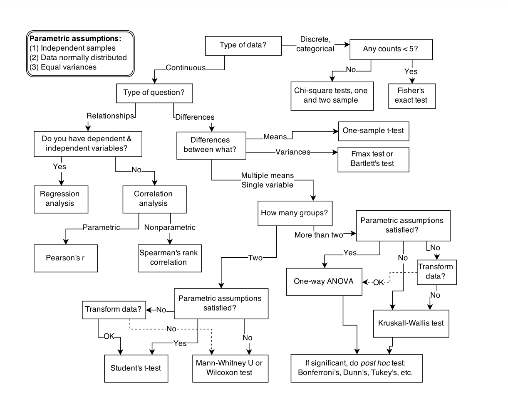

# Chapter 1 Notes - The Golem of Prague

## Summary of ideas

* Analogy of scientific models with the Golem of Prague
* Statistics should be seen as a set of design principles and constraints that produces a
great diversity of specialized applications, like engineering.
* Statistical inference's goal is not to test null hypothesis, because:
    * Models are not hypothesis
    * Data measurements matters
* "Science advances by falsifying hypotheses", Karl Popper. It's common
among scientists but not among philosophers of science, it's false (as proven before),
but it helps to open the eyes to know how statistics works.
* Statistical models expresses associations among variables, so to make one it's needed to
derive the expected frequency distribution of some quantity - "statistics" - from the casual model.
*

## Details
### Golem of Prague

Decision tree, or flowchart, for selecting an appropriate statistical procedure.

No statistical tool does anything on its own to address the basic problem
of inferring causes from evidence. Statistical golems do not understand cause and effect.
They only understand association. Without our guidance and skepticism, pre-manufactured
golems may do nothing useful at all. Worse, they might wreck Prague.

Rather than idealized angels of reason, scientific models are powerful clay
robots without intent of their own. Sometimes their unyielding logic reveals
implications previously hidden to their designers. These implications can
be priceless discoveries, or they may produce silly and dangerous behavior.

It's a triumph of statistical science that there are now so many diverse models,
each useful in a particular context. Viewed this way, statistics is neither mathematics
nor a science, but rather a branch of engineering. And like engineering, a common set of
design principles and constraints produces a great diversity of specialized applications.

## Rethinking statistics

What researchers need is some unified theory of model engineering, a set of principles for
designing, building, and refining special-purpose statistical procedures. Every major branch
of statistical philosophy possesses such a unified theory. But the theory is never taught in
introductory—and often not even in advanced—courses. So there are benefits in **rethinking
statistical inference as a set of strategies**, instead of a set of pre-made tools.

If you don’t understand how the model processes information, then you can’t interpret the
model’s output. This requires knowing the statistical model in greater detail than is
customary, and it requires doing the computations the hard way, at least until you are
 wise enough to use the push-button solutions.

Understanding any individual model is not enough,
in these cases. Instead, we need some statistical epistemology, an appreciation of how
statistical models relate to hypotheses and the natural mechanisms of interest.

Deductive falsification never works, the scientific method cannot
be reduced to a statistical procedure, and so our statistical methods should not pretend. Statistical evidence is part of the hot mess that is science, with all of its combat and egotism and
mutual coercion. If you believe that science does often work, then learning that it
doesn’t work via falsification shouldn’t change your mind. But it might help you do better
science, because it will open your eyes to many legitimately useful functions of statistical
golems.

### Hypothesis are not models

Relations among hypotheses (left), detailed process models
(middle), and statistical models (right), illustrated by the example of “neutral” models of evolution. Hypotheses (H) are typically vague, and so correspond to more than one process model (P). Statistical evaluations of hy-
potheses rarely address process models directly. Instead, they rely upon
statistical models (M), all of which reflect only some aspects of the process
models. As a result, relations are multiple in both directions: Hypotheses
do not imply unique models, and models do not imply unique hypotheses.
This fact greatly complicates statistical inference.

Unfortunately, statistical models do not embody specific causal relationships. A
statistical model expresses associations among variables. As a result, many different process
models may be consistent with any single statistical mode

How do we get a statistical model from a causal model? One way is to derive the expected frequency distribution of some quantity—a “statistic”—from the causal model.